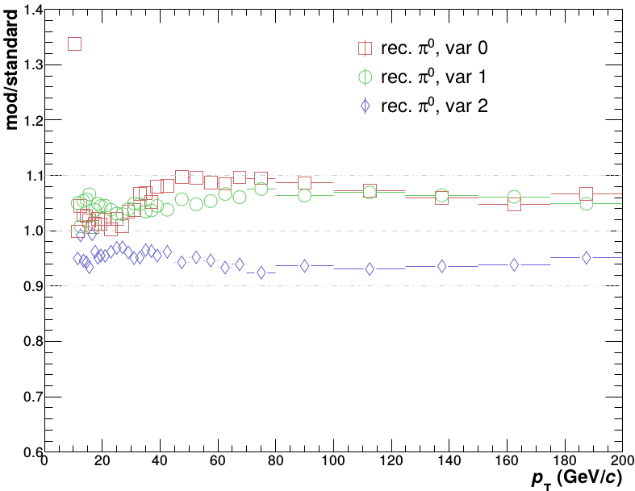
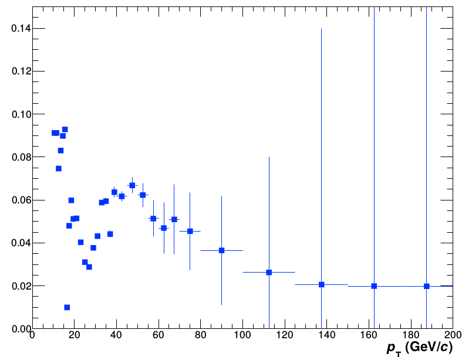
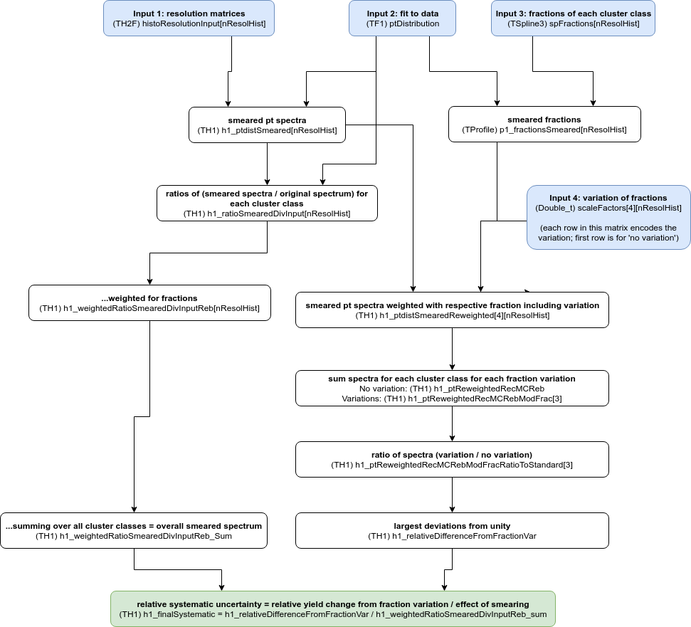

# Merged Analysis Toy Model for Momentum Resolution

This macro is used for varying the mixing of the different cluster categories in the merged cluster analysis.

In the analysis of merged clusters from pi0 or eta decay, we distinguish between four categories of clusters \(or cluster classes\):

1. The cluster contains both photons or two of the three Dalitz decay products.
2. The cluster contains one photon and one conversion, where one or both conversion electrons can be in the cluster.
3. The cluster is made up of only one photon or one fully contained conversion.
4. Only one electron is there, either from conversion or the Dalitz decay.

These different categories of clusters come each with a different momentum resolution, i.e. each category has its own resolution matrix. The cluster categories contribute to the spectrum with different fractions. **The purpose of the macro is to estimate the impact on the final meson spectrum that comes from a variation of the cluster category mixing.**

## How to use the macro

For running the macro, two items have to be provided:

* the **resolution matrix** for each cluster category, taken from the MC output
* the **fraction of each cluster category**, taken from the afterburner output

You might have to adjust the exact histogram names which are looked for in the macro.

Together with all the other parameters \(nEvents, particle type, energy, minPt, maxPt, mode...\) running the macro looks like this:

```text
root -b -l -q -x 'ToyModels/NeutralMesonDecay.C+(1e9,1,"8TeV",10,100,"pdf",440,"train_runs/Legotrain-vAN-20180215-8TeV-MC/LHC16c2_GammaCaloMerged_116.root","00081113_1111111067032200000_1111111067022700001_0163300000000000",10,"","00081113_1111111067032200000_1111111067022700001_0163300000000000/8TeV/Pi0_MC_GammaMergedCorrection_00081113_1111111067032200000_1111111067022700001_0163300000000000.root")'
```

## What happens in NeutralMesonDecay.C?

* Given from MC output are resolution matrix of each cluster category, and their fractions for each category. There is TH1D projection taken for every true pt bin from the resolution matrix. So we have the 1D distributions of the relative smearing for each true pt.
* Now we roll the dice for each event and do the following:

  * sample random pt from TCM fit and let's call it "true pt"
  * sample random relative smearing factor and apply on the true pt
  * fill TH1F of smeared pt
  * fill TProfile of the fraction vs. smeared pt
  * **The important output after this step is the ratio of smeared yield/generated yield**:

  

* After sampling several millions of events, we can now carry out the fraction variation. The smeared pt distribution of each cluster category is reweighted with the original fraction for a given smeared pt PLUS the fraction variation. Currently in use are the following three variations of the mixing of the cluster categories:

  * variation 0:  \(cat. 3, single photons\) up by 20 percent points,  \(cat. 2, partially converted\) down by 20 percent points
  * variation 1: \(cat. 1, two photons\) up by 20 percent points, \(cat. 2, partially converted\) down by 20 percent points
  * variation 2: \(cat. 2, partially converted\) up by 20 percent points, \(cat. 1, two photons\) down by 20 percent points
  * **The important output at this step is a ratio comparing the smeared yield after fraction variation with the smeared yield without variation**:

  

* Now the corrected yield after fraction variation can be obtained \(undoing smearing\):

  corrected yield after variation = smeared yield from variation / \(ratio smeared yield/generated yield\)

  Equivalently:

  **relative corrected yield change after variation = relative smeared yield difference from variation / \(ratio smeared yield/generated yield\)**,

  which is the \(relative\) sys. uncertainty accounting for the insufficiently known fractions of each cluster category and therefore, the sys. uncertainty for momentum resolution:

  

The code structure can be confusing at first glance. Here is a schematic to help, if you aim for a detailed understanding of the macro:



