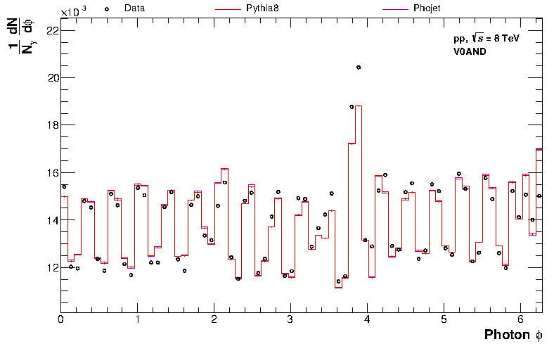
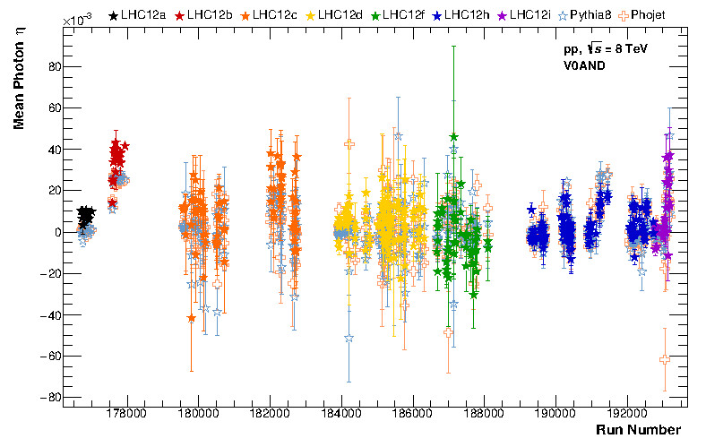

# PhotonQA

**This part of the QA must be run for any PCM related analysis \(for PCM and hybrid analyses PCM-EMCal, PCM-PHOS, PCM-DCal\)**

The photon QA includes all cut variables in the context of conversion photon analysis:

**generated histograms \(list of examples\)** \(full set of generated histograms can be deduced from the macros themselves/or from the output generated\): 1. Electron level: $$p_T$$, $$\eta$$, dE/dx, TPC clusters, findable TPC clusters,... 2. Photon level: $$p_T$$, $$\eta$$, $$\phi$$, $$\alpha$$, invariant mass, chi2, psi-pair,...

Running the PhotonQA\(\_Runwise\).C will save the output into the following folder structure:

> _CUTNUMBER/SYSTEM/PhotonQA/_

In addition, \*.root files will be generated in _CUTNUMBER/SYSTEM/_ containing all the histograms as well.

**important note** Run QA\_RunwiseV2.C first\(!\) with doEventQA = kTRUE and doPhotonQA = kTRUE - it will read TTrees from runwise output and generate runwise QA plots. It will also merge the output from different runs as this is, in general, impossible to do on TTree level due to the huge file sizes. Then run QAV2.C.

Carefully check all output from runwise histograms with special focus on data/MC comparison \(Is the MC able to reproduce all QA histograms extracted from data? Does the MC follow the trends seen in data? Are there any suspicious runs or any observations that cannot be explained?...\)

Some example plots for 1. and 2.:

1.  2.  

