# TPC Spline Creation

A detailed explanation of the procedure can be found in Analysis Notes [The TPC Multi-Template Fit - Method and Application for Particle Identification in ALICE](https://alice-notes.web.cern.ch/node/272).

**Requirements**

* For this analysis a set of macros is required. They can be found in AliRoot at $ALICE\_PHYSICS/PWGPP/TPC/macros/PIDCalib 
* Make sure you have full read and write access on the data files!

**Legotrain setting**

Lego train page of AdHocCalibration: [https://alimonitor.cern.ch/trains/train.jsp?train\_id=46](https://alimonitor.cern.ch/trains/train.jsp?train_id=46)

**Comments**

* Consider wagon dependencies
* Check the macro parameters, if they are appropriate for the period under consideration
* Examples above are for 2010 rereconstruction

**Iteration procedure**

The following guide will provide the necessary steps to create splines step by step. _IMPORTANT:_ The bold text in the code lines needs to be changed to match your settings/files/folders.

**First Iteration**

**Legotrain settings**

* TPCcalibResidualPID\_noqa\_noEtaCorr
* TPCPIDEtaTree\_pp
* PIDQATask \(check dEdx plot, no splines yet, so nSigma will be off\)
* Upload splines and Eta map to AliEn for subsequent iterations.

**Step 1 : Load Framework**

* To run the macros it is required to load the AliRoot-Environment.

**Step 2 : Create Splines**

* IMPORTANT: The following examples show how the splines creation for Data from LHC11h pass2 would work. Please change the code parameters for period \(eg. LHC11H\), splines name \(eg. splines\_11h.pass2.root\), pass \(eg. PASS2\) and collision system \(eg. PBPB\) to match your data. 
* Create the splines by executing:

> bash extract TPCresidualPID.root splines\_11h.pass2.root DATA LHC11A PASS2 PBPB

* Rename the eta tree file to _bhess\_PIDetaTree.root_. This file will only be created once and will be used in all upcoming iterations:

> mv TPCPIDEtaTree.root bhess\_PIDetaTree.root

* The script will create a file called _splines\_11h.pass2.root_ as well as multiple root files containing plots. Check the pions plot in the file _splines\_QA\_ResidualGraphsTOF.root_ for a mid position of about 50 as seen in the example plot below.

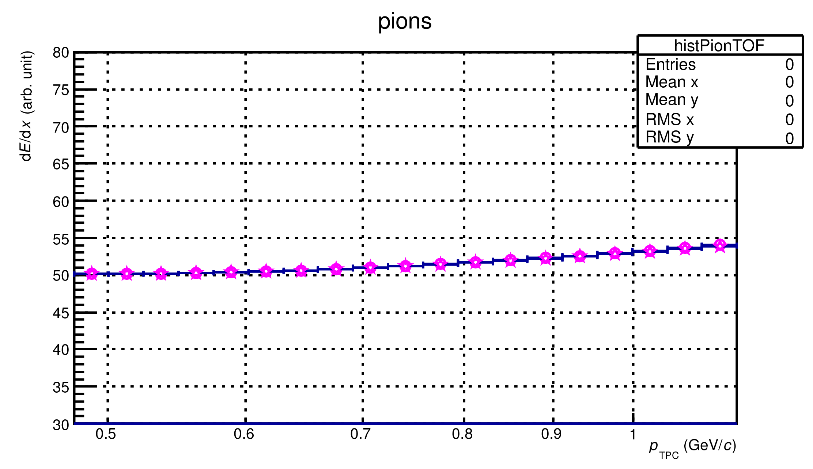

* If a shadow around the distribution can be seen, then one or more of your runs might be bad and should be excluded.&lt;/br&gt;

  The example plots show how this influences the data. On the _left side_ a distribution coming from bad runs is influencing the data. On the _right side_ an example plot for good data is shown.

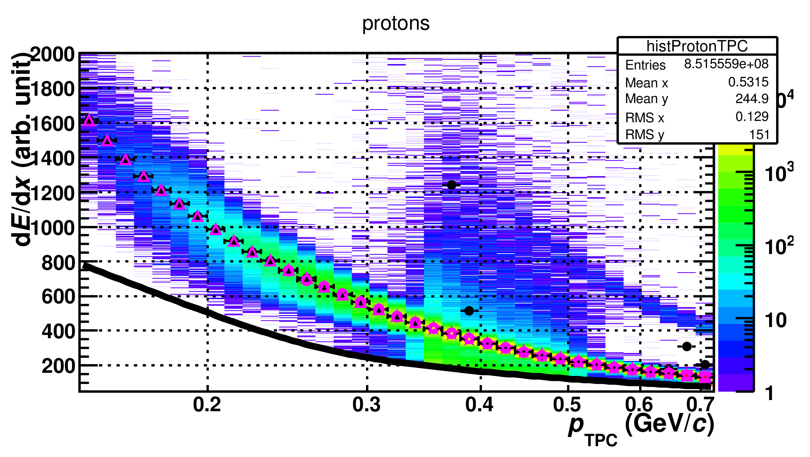

* Inside the _splines\_QA\_BetheBlochFit.root_ file the residuals should not exceed 0.01 \(with the next iterations this will decrease to 0.001 and no longer show a trend\).
* Check the _splines\_QA\_ResidualPolynomials.root_ file for the protons at low βγ  \(blue empty triangles\). The fit should work within +-1%.

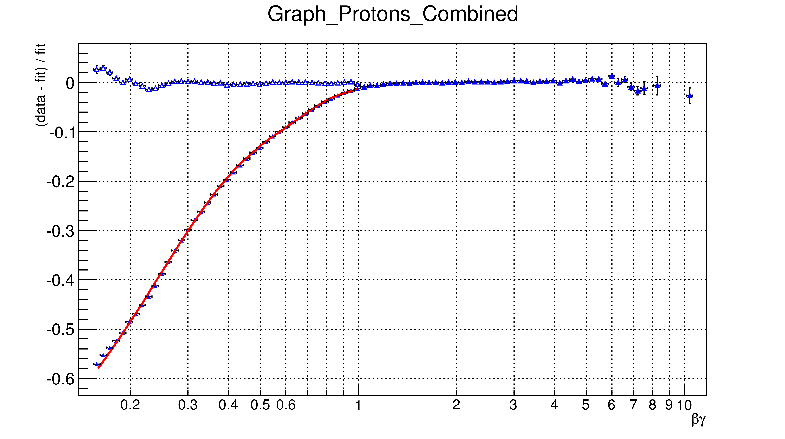 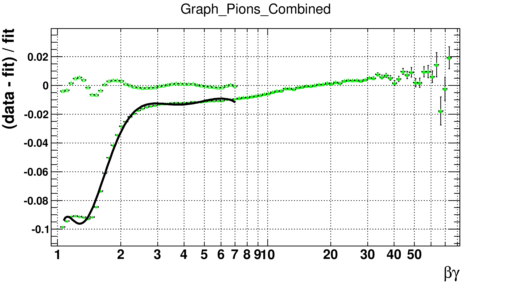 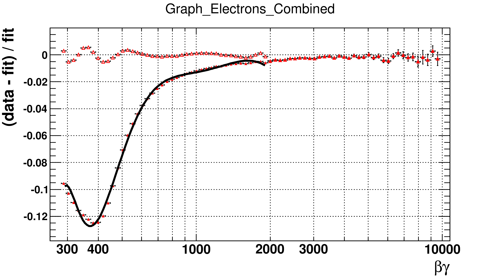

**Step 3 : Create Eta Map**

* Calculate the expected dE/dx by applying the splines on the tree:

  > aliroot 'correctShapeEtaTree.C+\(kFALSE, "", "", "", kTRUE, "**YOUR\_PATH\_TO\_FILE/splines\_10h.pass2.root**", "**TSPLINE3\_DATA\_PROTON\_LHC11H\_PASS2\_PBPB\_MEAN**", "**YOUR\_PATH\_TO\_FILE**", kFALSE, kFALSE, "bhess\_PIDetaTree.root"\)' -b -q

* The parts indicated in bold letters need to be changed to match to your folder and period. The macro will output a file called bhess\_PIDetaTree\_NewSplines\_\_\_year\_month\_day\_\_hour\_min.root with the actual date and time in the filename. Use this ouput to create the map:

> aliroot 'checkShapeEtaTree.C+\(0x0,**2, 2, 0.7, 0, 3, 3, 0.04**, kFALSE, 0, 60,**"YOUR\_PATH\_TO\_FILE"**, "\_NewSplines\_\_year\_month\_day\_hour\_min"\)' -b -q

* The first 2 bold parameters stand for the binning of the maps in x and y \(_2,2_ --&gt; smaller values lead to higher resolution\). The next two numbers stand for the threshold for the TOF cut \(_0.7_\) and the amount of bins that should be merged around the threshold \(_0_\). The next two numbers stand for the pT threshold of the V0 cut \(_3_\) and the V0+TOF cut \(_3_\). The last number \(_0.04_\) stands for the maximum allowed deviation between to points of the map. If the deviation exceeds this value, then the value of this outlier will be calculated as the mean value of its neighbouring datapoints.
* The ouput file of this macro _outputCheckShapeEtaTree\_year\_month\_day\_\_hour\_min\_\_NewSplines\_\_\_year\_month\_day\_\_hour\_min.root_ contains several plots. The histogram hMomTranslation shows how the momentum is translated into dE/dx. The most important histogram is hPureResults which should be viewed in surf1. There should be no kinks or strong asymmetries visible.

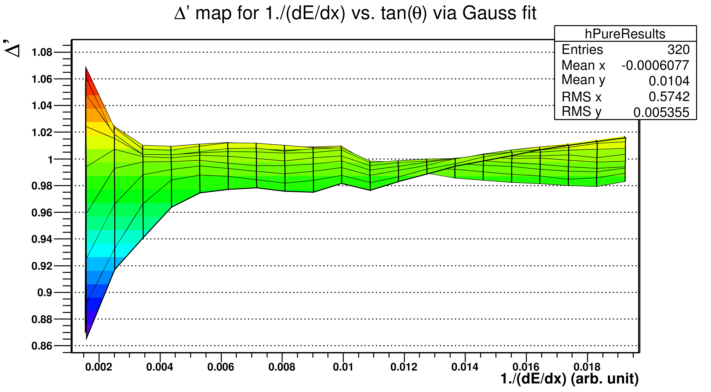

* The folder ClusterQA inside the output file contains several plots with the gaussian fit mean value, sigma and sigma/mean for different momenta and pseudorapidities. An example how this should ideally look like is shown below. However the fit does not describe the data perfectly in every theta and transverse momentum bin.

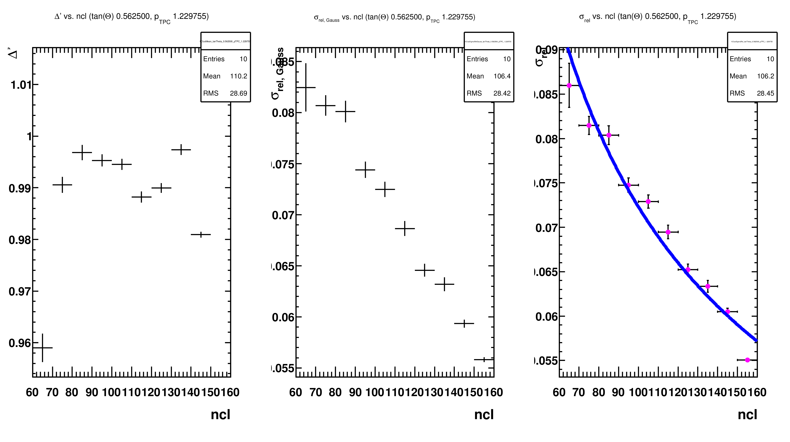

**Step 4 : Correction of the Eta Map**

* The previously created eta map is used to correct the data. For this the same macros are used again but with different parameters:

  > aliroot 'correctShapeEtaTree.C+\(**kTRUE**, "**YOUR\_PATH\_TO\_TREE**", "**outputCheckShapeEtaTree\_year\_month\_day\_\_hour\_min\_\_NewSplines\_\_\_year\_month\_day\_\_hour\_min.root**", "NoNormalisation", kTRUE, "**YOUR\_PATH\_TO\_FILE/splines\_11h.pass2.root**", "**TSPLINE3\_DATA\_PROTON\_LHC11H\_PASS2\_PBPB\_MEAN**", "**YOUR\_PATH\_TO\_TREE**", kFALSE, kFALSE, "bhess\_PIDetaTree.root"\)' -b -q

> aliroot 'checkShapeEtaTree.C+\(0x0, 2, 2, 0.7, 0, 3, 3,**0.2**,**kTRUE**, 0, 60, "YOUR\_PATH\_TO\_TREE","**\_CorrectedWithMap\_outputCheckShapeEtaTree\_year\_month\_day\_\_hour\_min\_\_NewSplines\_\_\_year\_month\_day\_\_hour\_min\_\_\_year\_month\_day\_\_hour\_min**"\)' -b -q

**Step 5 : Produce QA Plots for this Iteration**

* The following code will produce a root file containing the final mean values, standard deviations and chi squares for the fits:

  > aliroot 'checkPullTree.C+\("**YOUR\_PATH\_TO\_TREE/**", "**YOUR\_PATH\_TO\_FILE/outputCheckShapeEtaTree\_year\_month\_day\_\_hour\_min\_\_NewSplines\_\_\_year\_month\_day\_\_hour\_min.root**","**YOUR\_PATH\_TO\_FILE/outputCheckShapeEtaTree\_year\_month\_day\_\_hour\_min\_\_CorrectedWithMap\_outputCheckShapeEtaTree\_year\_month\_day\_\_hour\_min\_\_NewSplines\_\_\_year\_month\_day\_\_hour\_min\_\_\_year\_month\_day\_\_hour\_min.root**", "NoNormalisation", 0, kTRUE, 2, "**YOUR\_PATH\_TO\_FILE/splines\_11h.pass2.root**", "**TSPLINE3\_DATA\_PROTON\_LHC11H\_PASS2\_PBPB\_MEAN**"\)' -b -q

* The black points in these plots represent the mean value and should be around zero. The magenta points show the standard deviation and should ideally be around unity. The dark magenta line shows the reduced χ² divided by -10 and should be very close to zero.
* This is just a first estimate to see if the parametrization works as intended. As seen in the plot, deviations below 0.3 GeV/c can occur.

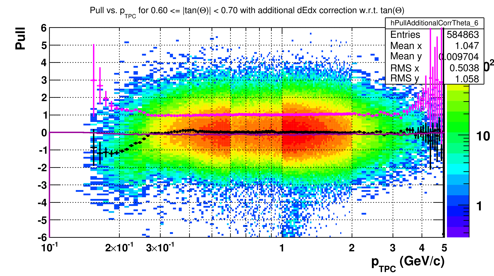

**Second iteration**

**Legotrain settings**

* TPCcalibResidualPID\_noqa\_withEtaCorr
* Instructions how to use the new splines \(lego train, but can also be adapted to batch farms\):
* deactivate the wagon with the standard "PIDResponse"
* clone the "PIDResponse" wagon and label it "PIDResponse\_special"
* macro path is unchanged: "$ALICE\_ROOT/ANALYSIS/macros/AddTaskPIDResponse.C"
* parameters are:
* kFALSE, kTRUE, kFALSE, 2, kFALSE, "TPC:alien:///alice/cern.ch/user/b/bhess/PID/TPCPIDResponse.root;TPC-Maps:alien:///alice/cern.ch/user/b/bhess/PID/TPCetaMaps.root", kTRUE, kTRUE, -1
* The files TPCPIDResponse.root and TPCetaMaps.root are the files from the last iteration and should be stored in the respective places on AliEn.
* \(note: for aliroot versions prior to the splitting in aliroot and aliphysics, you need to replace "$ALICE\_PHYSICS" by "$ALICE\_ROOT" in the above parameters\)
* change the wagon dependencies from "PIDResponse" to "PIDResponse\_special", whereever needed \(in particular for your analysis wagons\)
* Upload splines and Eta map to AliEn for subsequent iterations.

**Procedure**

* The second iteration is similar to the first iteration. The only difference is that the tree file from the first iteration _bhess\_PIDetaTree.root_ must be used as input for this iteration. This is because the tree will be adjusted by "correctShapeEtaTree".
* The procedure is then the same. Replace the bold parts in the code and run it over the new trainoutput.

> aliroot 'correctShapeEtaTree.C+\(kFALSE, "", "", "", kTRUE, "**YOUR\_PATH\_TO\_FILE/splines\_11h.pass2.root**", "**TSPLINE3\_DATA\_PROTON\_LHC11H\_PASS2\_PBPB\_MEAN**", "**YOUR\_PATH\_TO\_TREE**", kFALSE, kFALSE, "bhess\_PIDetaTree.root"\)' -b -q aliroot 'checkShapeEtaTree.C+\(0x0,**2, 2, 0.7, 0, 3, 3, 0.04**, kFALSE, 0, 60,**"YOUR\_PATH\_TO\_TREE"**, "**\_NewSplines\_\_\_year\_month\_day\_\_hour\_min**"\)' -b -q
>
> aliroot 'correctShapeEtaTree.C+\(**kTRUE**, "**YOUR\_PATH\_TO\_TREE**", "**outputCheckShapeEtaTree\_year\_month\_day\_\_hour\_min\_\_NewSplines\_\_\_year\_month\_day\_\_hour\_min.root**", "NoNormalisation", kTRUE, "**YOUR\_PATH\_TO\_FILE/splines\_11h.pass2.root**", "**TSPLINE3\_DATA\_PROTON\_LHC11H\_PASS2\_PBPB\_MEAN**", "**YOUR\_PATH\_TO\_TREE**", kFALSE, kFALSE, "bhess\_PIDetaTree.root"\)' -b -q
>
> aliroot 'checkShapeEtaTree.C+\(0x0, 2, 2, 0.7, 0, 3, 3,**0.2**,**kTRUE**, 0, 60, "YOUR\_PATH\_TO\_TREE","**\_CorrectedWithMap\_outputCheckShapeEtaTree\_year\_month\_day\_\_hour\_min\_\_NewSplines\_\_\_year\_month\_day\_\_hour\_min\_\_\_year\_month\_day\_\_hour\_min**"\)' -b -q

**Third iteration**

**Legotrain settings**

* TPCPIDEtaQA\_pp
* PIDQATask
* TPCcalibResidualPID\_noqa\_withEtaCorr
* Final QA -&gt; If QA is successful then commit splines.

**Procedure**

* The third iteration is the QA-iteration.
* The first step is to run the macro "checkShapeEta.C" on the "TPCPIDEtaQA.root" file using:

  > aliroot 'checkShapeEta.C+\("PATH\_TO\_FILE", -1,-1, 0, "TPCPIDEtaQA.root", "TPCPIDEtaQA"\)'

* This will produce a file called "outputCheckShapeEtaAdv\_year\_month\_day\_hour\_minute.root" containing several 1D and 2D histograms representing the eta dependence.

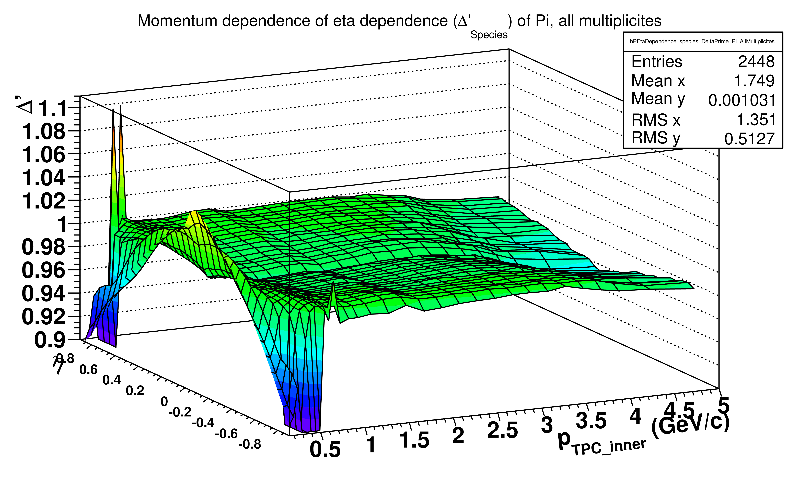 

 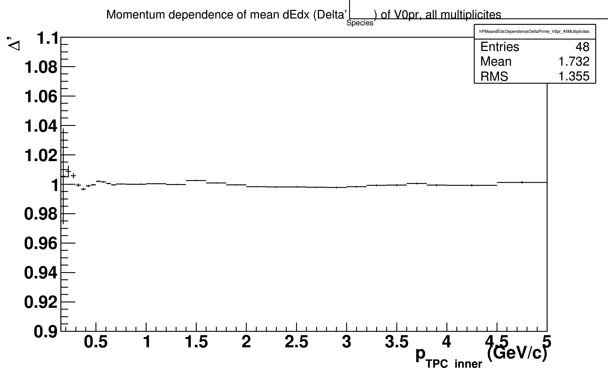

* The final part is to produce the final QA plots using:

  > aliroot -l -b -q $ALICE\_ROOT/ANALYSIS/macros/MakePIDqaReport.C+'\("PATH\_TO/AnalysisResults.root", "PIDqaReport.pdf", "SAME\_PATH\_AS\_FOR\_ANALYSISRESULTS/PIDqa"\)'

* The output is a pdf file showing the QA results for the different PID systems. Example plots are shown below where the magenta points should be around unity and the black points around zero. This only applies for the regions without large contamination.

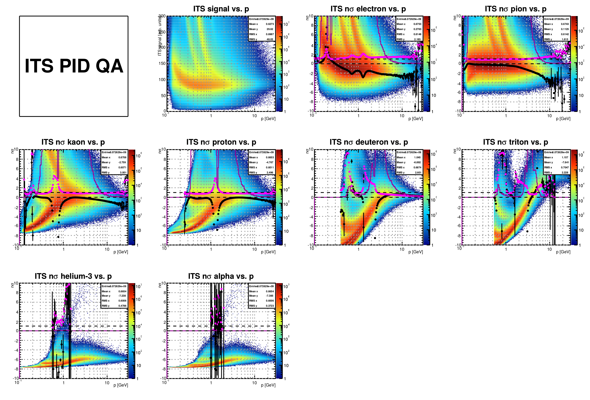 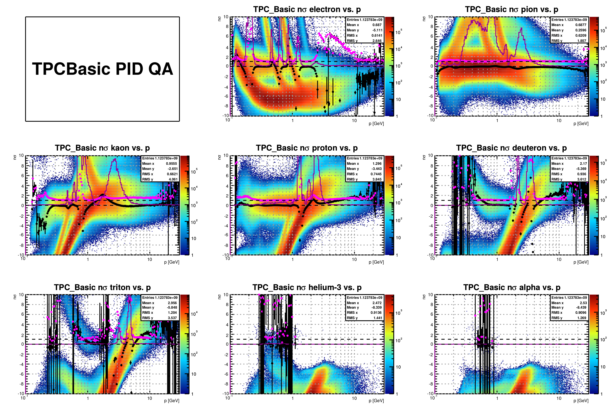

**Expected Accuracy**

* The following points are only valid for samples/regions with little contamination
* No strong deviations from mean or width in the plots of "MakePIDqaReport"
* In the 1d-plots of "outputCheckShapeEtaAdv\_year\_month\_day\_hour\_minute.root": The mean value is within +-0.2% around unity for all hadrons up to p = 6 GeV/c and for other particles \(especially electrons\) within +-1.5%
* In the 2D-plots of "outputCheckShapeEtaAdv\_year\_month\_day\_hour\_minute.root" : Eta-dependence within +-0.5% around unity for p &gt; 0.45 GeV/c
* In the plots of "MakePIDqaReport" the magenta histogram should be close to unity which means that the resolution was parametrized in a good way. In detail, the fitted nSigma width \(magenta\) should typically be within +-3% around unity
* Depending on your needs, the deviations can be larger than the values stated above 

**Comparison of Splines**

* A final check is to compare the splines to the previous iteration to see if there were significant changes. If the changes are too large, then either an additional iteration is required or the splines won't converge and you have to keep your current splines.
* To compare the splines use the following:

  > aliroot 'compareSplines.C\("PATH\_TO\_YOUR\_SPLINE\_FILE\_\_ITERATION2/splines\_12a.pass2.root", "PATH\_TO\_YOUR\_SPLINE\_FILE\_\_ITERATION3/splines\_12a.pass2.root", "LHC12A\_PASS2", "DATA", "PP", "", "", "", kFALSE, kFALSE, "Iter2", "Iter3", kFALSE\)'

* The first two parameters represent the location of the two splines from different iterations. You also should change the period, pass, data/mc and collision system. The strings "Iter2" and "Iter3" will be the axis labels of the final plot.
* The splines should only show changes in the order of some permille.

**Further iterations**

* If anything does not match in the final QA repeat the previous steps again.

**Comments**

